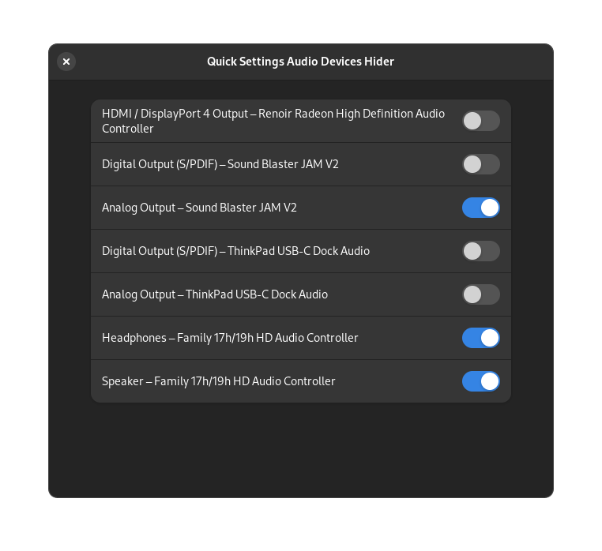

# Quick Settings Audio Devices Hider Gnome Extension

This is a Gnome Extension that allows you to hide the devices that you do not
need in the Quick Settings Audio Panel.
It makes it easier to switch fast between your audio devices when the panel
is decluttered from the outputs you're not going to ever choose anyway.

## Configuration

The shown/hidden devices may be configured via preferences window

Note that the extension does not disable the device in the system. All the devices
are still going to be visible in the Control Panel. All this extension does is
to hide the unneeded devices from the Quick Settings panel.
