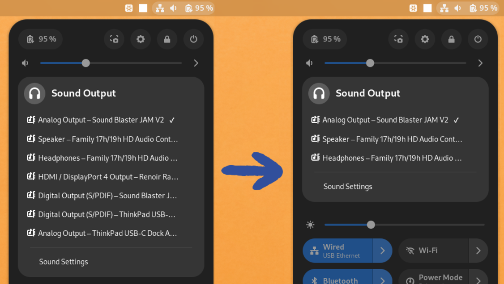

#  Quick Settings Audio Devices Hider Gnome Extension

<a href="https://extensions.gnome.org/extension/5964/quick-settings-audio-devices-hider/">

</a>

This is a Gnome Shell Extension that allows you to hide the devices that you do
not need in the Quick Settings Audio Panel. It supports both output and input devices. It makes it easier to switch fast
between your audio devices when the panel is decluttered from the entries you're
not going to ever choose anyway.



> [!TIP]
> Also try the [Quick Settings Audio Devices Renamer](https://github.com/marcinjahn/gnome-quicksettings-audio-devices-renamer-extension) extension!

## Configuration

The shown/hidden devices may be configured via preferences window.

### Output Devices


### Input Devices


## Contributing

In case of problems, it's a good idea to open an
[Issue](https://github.com/marcinjahn/gnome-quicksettings-audio-devices-hider-extension/issues).
If you know how to fix it, open a [Pull
Request](https://github.com/marcinjahn/gnome-quicksettings-audio-devices-hider-extension/pulls)!

### Local Development

To run the extension locally "from sources":

```
git clone git@github.com:marcinjahn/gnome-quicksettings-audio-devices-hider-extension.git
cd gnome-quicksettings-audio-devices-hider-extension
npm i
npm run build
npm run linkdist
```

The last command will creae a soft link at
`~/.local/share/gnome-shell/extensions/quicksettings-audio-devices-hider@marcinjahn.com`,
which allows you to enable the extension on your system (e.g., via [Extensions
Manager](https://flathub.org/apps/com.mattjakeman.ExtensionManager)).

Anytime you change anything, rebuild the extension with `npm run build`, and
restart the session:

- on Wayland, log out and log in (I know, it's painful),
- on X11, open "Run a Command" dialog (Alt + F2), type "r" and press Enter

## Remarks

Note that the extension does not disable the device in the system. All the devices
are still going to be visible in the Control Panel. All this extension does is
to hide the unneeded devices from the Quick Settings panel.

## Mentions

- [OMG! Ubuntu](https://www.omgubuntu.co.uk/2023/05/hide-audio-devices-gnome-quick-settings)
