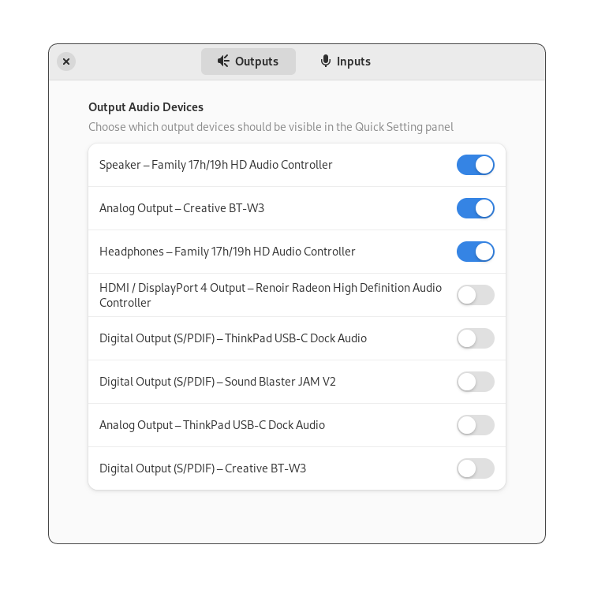

# Quick Settings Audio Devices Hider Gnome Extension

This is a Gnome Shell Extension that allows you to hide the devices that you do
not need in the Quick Settings Audio Panel. It supports both output and input devices. It makes it easier to switch fast
between your audio devices when the panel is decluttered from the entries you're
not going to ever choose anyway.

## Configuration

The shown/hidden devices may be configured via preferences window

Note that the extension does not disable the device in the system. All the devices
are still going to be visible in the Control Panel. All this extension does is
to hide the unneeded devices from the Quick Settings panel.
